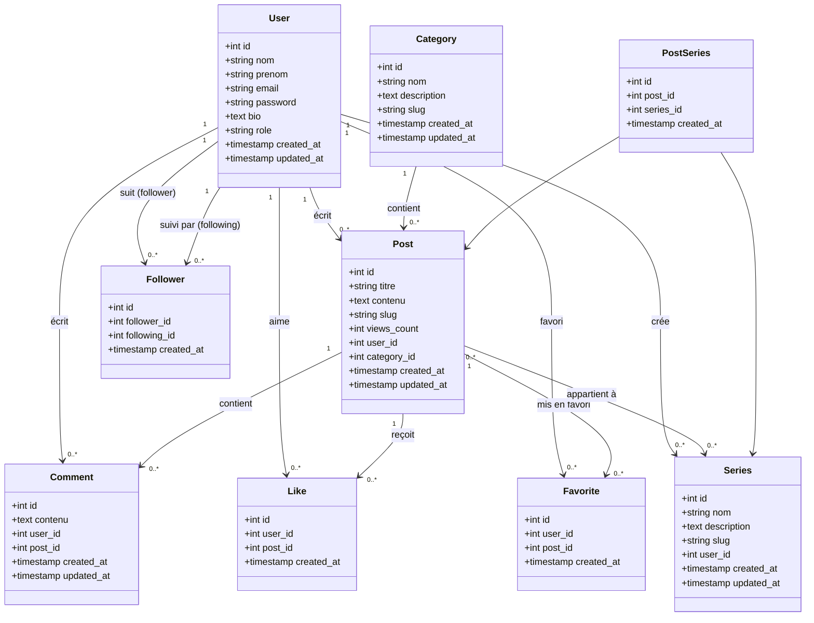

# Clone de DEV.to

## Diagramme de Classes



## Fonctionnalités (CRUD)

### C=Create | R=Read | U=Update | D=Delete

#### C.R.U.D DE CATEGORY

- Gestion complète des catégories

#### C.R.U.D DE POST

- Dans la liste des postes, renvoyer 5 posts de même catégories
- Gérer le nombre de vues du post
- Recherche globale sur les posts par mot clés

#### C.R.U.D DE COMMENTS

- Renvoyer la liste des commentaires par post

#### C.R.U.D DE FOLLOWERS

- Suivre/Ne plus suivre des utilisateurs

#### C.R.U.D DE SERIES

- Renvoyer la liste des posts pour une série

### Fonctionnalités supplémentaires

- Ajouter un post en favoris
- Supprimer un post des favoris
- Liker un post
- Unlike un post

## Endpoints API

### Authentication

```
POST   /api/register                # Créer un nouveau compte utilisateur
POST   /api/login                   # Se connecter
POST   /api/logout                  # Se déconnecter
GET    /api/user                    # Obtenir l'utilisateur connecté
```

### Categories

```
GET    /api/categories              # Liste de toutes les catégories
POST   /api/categories              # Créer une nouvelle catégorie
GET    /api/categories/{id}         # Détails d'une catégorie
PUT    /api/categories/{id}         # Mettre à jour une catégorie
DELETE /api/categories/{id}         # Supprimer une catégorie
GET    /api/categories/{id}/posts   # Liste des posts d'une catégorie
```

### Posts

```
GET    /api/posts                   # Liste de tous les posts
POST   /api/posts                   # Créer un nouveau post
GET    /api/posts/{id}              # Détails d'un post (incrémente les vues)
PUT    /api/posts/{id}              # Mettre à jour un post
DELETE /api/posts/{id}              # Supprimer un post
GET    /api/posts/search            # Recherche globale de posts par mot-clés
GET    /api/posts/{id}/related      # 5 posts de la même catégorie
GET    /api/posts/{id}/comments     # Liste des commentaires d'un post
```

### Comments

```
GET    /api/comments                # Liste de tous les commentaires
POST   /api/comments                # Créer un nouveau commentaire
GET    /api/comments/{id}           # Détails d'un commentaire
PUT    /api/comments/{id}           # Mettre à jour un commentaire
DELETE /api/comments/{id}           # Supprimer un commentaire
GET    /api/posts/{id}/comments     # Commentaires d'un post spécifique
```

### Series

```
GET    /api/series                  # Liste de toutes les séries
POST   /api/series                  # Créer une nouvelle série
GET    /api/series/{id}             # Détails d'une série
PUT    /api/series/{id}             # Mettre à jour une série
DELETE /api/series/{id}             # Supprimer une série
GET    /api/series/{id}/posts       # Liste des posts d'une série
POST   /api/series/{id}/posts       # Ajouter un post à une série
DELETE /api/series/{id}/posts/{postId}  # Retirer un post d'une série
```

### Likes

```
POST   /api/posts/{id}/like         # Liker un post
DELETE /api/posts/{id}/like         # Unlike un post
GET    /api/posts/{id}/likes        # Liste des likes d'un post
GET    /api/users/{id}/likes        # Posts likés par un utilisateur
```

### Favorites

```
POST   /api/posts/{id}/favorite     # Ajouter un post aux favoris
DELETE /api/posts/{id}/favorite     # Retirer un post des favoris
GET    /api/users/{id}/favorites    # Posts favoris d'un utilisateur
```

### Followers

```
POST   /api/users/{id}/follow       # Suivre un utilisateur
DELETE /api/users/{id}/follow       # Ne plus suivre un utilisateur
GET    /api/users/{id}/followers    # Liste des followers d'un utilisateur
GET    /api/users/{id}/following    # Liste des utilisateurs suivis
```

### Users

```
GET    /api/users                   # Liste des utilisateurs
GET    /api/users/{id}              # Profil d'un utilisateur
PUT    /api/users/{id}              # Mettre à jour son profil
GET    /api/users/{id}/posts        # Posts d'un utilisateur
```

## Notes Techniques

### Relations importantes

1. **User ↔ Post** : Un utilisateur peut créer plusieurs posts (1:N)
2. **Category ↔ Post** : Une catégorie contient plusieurs posts, un post appartient à une seule catégorie (1:N)
3. **Post ↔ Series** : Un post peut appartenir à plusieurs séries (N:N via table pivot PostSeries)
4. **User ↔ User (Followers)** : Relation réflexive many-to-many pour le système de suivi
5. **User ↔ Post (Likes)** : Un utilisateur peut liker plusieurs posts (N:N)
6. **User ↔ Post (Favorites)** : Un utilisateur peut avoir plusieurs posts en favoris (N:N)
