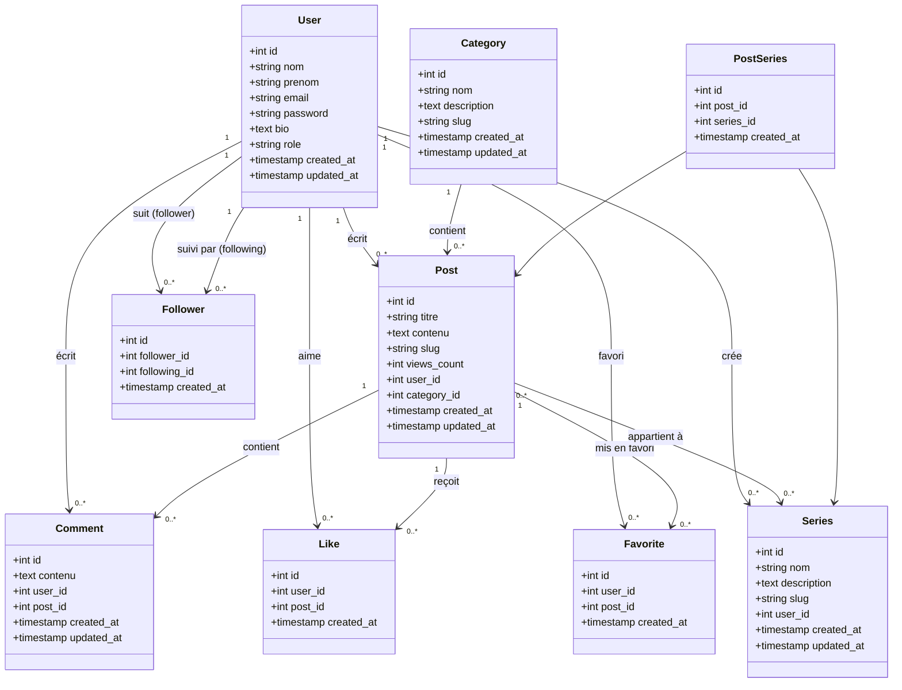

# Clone de DEV.to

## Diagramme de Classes

## Fonctionnalités (CRUD)

### C=Create | R=Read | U=Update | D=Delete

#### C.R.U.D DE CATEGORY

- Gestion complète des catégories

#### C.R.U.D DE POST

- Dans la liste des postes, renvoyer 5 posts de même catégories
- Gérer le nombre de vues du post
- Recherche globale sur les posts par mot clés

#### C.R.U.D DE COMMENTS

- Renvoyer la liste des commentaires par post

#### C.R.U.D DE FOLLOWERS

- Suivre/Ne plus suivre des utilisateurs

#### C.R.U.D DE SERIES

- Renvoyer la liste des posts pour une série

### Fonctionnalités supplémentaires

- Ajouter un post en favoris
- Supprimer un post des favoris
- Liker un post
- Unlike un post

## Notes Techniques

### Relations importantes

1. **User ↔ Post** : Un utilisateur peut créer plusieurs posts (1:N)
2. **Category ↔ Post** : Une catégorie contient plusieurs posts, un post appartient à une seule catégorie (1:N)
3. **Post ↔ Series** : Un post peut appartenir à plusieurs séries (N:N via table pivot PostSeries)
4. **User ↔ User (Followers)** : Relation réflexive many-to-many pour le système de suivi
5. **User ↔ Post (Likes)** : Un utilisateur peut liker plusieurs posts (N:N)
6. **User ↔ Post (Favorites)** : Un utilisateur peut avoir plusieurs posts en favoris (N:N)
